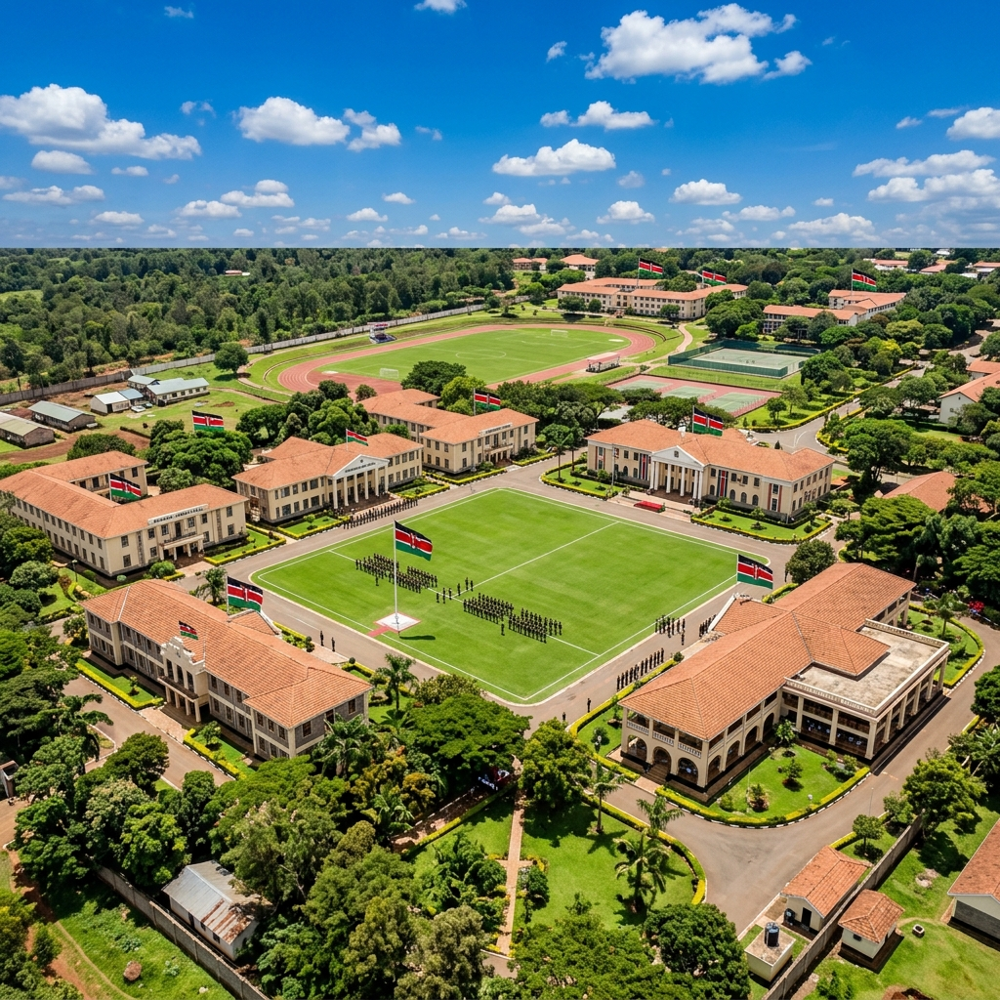

# 🏫 Moi Barracks School — Official Website

A modern, fully responsive school website for **Moi Barracks School**, Eldoret, Kenya.



## ✨ Features

- 🎨 **Stunning Design** — Navy & Gold color scheme with glassmorphism effects
- 📱 **Fully Responsive** — Mobile-first, works on all screen sizes
- ⚡ **Smooth Animations** — Scroll-reveal, parallax hero, particle effects
- 🎭 **Gallery with Filter** — Tab-based category filtering
- 📊 **Animated Stats Counter** — Numbers animate on scroll
- 💬 **Testimonials Slider** — Auto-advancing with dot navigation
- 📝 **Enquiry Form** — With simulated async submission
- 📧 **Newsletter Signup** — Footer newsletter form
- ♿ **Accessible** — ARIA labels, semantic HTML, keyboard navigable

## 📁 Project Structure

```
Moi_Barracks_web/
├── index.html          # Main HTML page
├── css/
│   └── style.css       # Complete design system & styles
├── js/
│   └── main.js         # All interactivity & animations
├── images/
│   ├── hero_bg.png     # Hero parallax background
│   ├── students.png    # Students on parade grounds
│   ├── library.png     # School library
│   ├── sports.png      # Sports activities
│   └── science_lab.png # Science laboratory
└── README.md
```

## 🚀 Getting Started

Simply open `index.html` in any modern web browser — no build step required!

```bash
# Or serve with any local server, e.g.:
npx serve .
```

## 🌐 Sections

| Section | Description |
|---------|-------------|
| **Hero** | Full-screen banner with parallax, particles, and stats |
| **About** | School history, mission, vision, and values |
| **Academics** | Primary, Secondary, and Co-curricular programs |
| **Admissions** | Step-by-step guide + quick enquiry form |
| **Gallery** | Filterable photo gallery |
| **News & Events** | Latest school news and announcements |
| **Testimonials** | Auto-sliding community testimonials |
| **Contact** | Contact details, social links, and map |

## 🎨 Design System

- **Colors**: Deep Navy `#0D1B2A` + Gold `#F4A81D`
- **Fonts**: [Outfit](https://fonts.google.com/specimen/Outfit) + [Inter](https://fonts.google.com/specimen/Inter)
- **Effects**: Glassmorphism, gradient text, smooth transitions

## 📞 Contact

**Moi Barracks School**  
Eldoret, Uasin Gishu County, Kenya  
📧 info@moibarracksschool.ac.ke  
📞 +254 53 400 0000

---

*Built with ❤️ for excellence in education — "Discipline, Duty, Destiny"*
